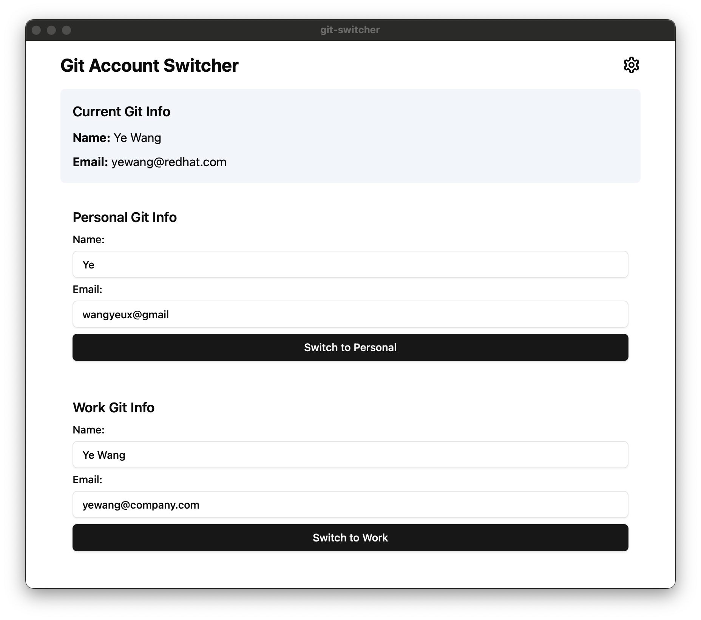

# Git Account Switcher

Git Account Switcher is a simple and user-friendly tool built with Tauri and React. It allows users to easily switch between personal and work Git accounts.



[View full-size image](assets/preview.png)

## Table of Contents

- [Git Account Switcher](#git-account-switcher)
  - [Table of Contents](#table-of-contents)
  - [Installation](#installation)
  - [Usage](#usage)
  - [Features](#features)
  - [Contributing](#contributing)
  - [License](#license)

## Installation

To install Git Account Switcher, follow these steps:

1. Ensure you have Rust, Nodejs and pnpm installed on your system.
2. Clone the repository:
   ```
   git clone https://github.com/yportfolio/git-switcher.git
   cd git-switcher
   ```
3. Install the required dependencies:
   ```
   pnpm install
 
4. Run the application:
   ```
   pnpm tauri dev
   ```

5. Build the application:
   ```
   pnpm tauri build
   ```

## Usage

To use Git Account Switcher:

1. Launch the application.
2. Configure your work and personal Git accounts.
3. Use the interface to switch between your configured accounts.

For more detailed instructions, please refer to our [user guide](docs/USER_GUIDE.md).

## Features

- Easy switching between multiple Git accounts
- User-friendly interface built with React
- Cross-platform support thanks to Tauri
- Secure storage of Git credentials
- Automatic updating of Git configuration

## Contributing

We welcome contributions to Git Account Switcher! Here's how you can help:

1. Fork the Project
2. Create your Feature Branch (`git checkout -b feature/AmazingFeature`)
3. Commit your Changes (`git commit -m 'Add some AmazingFeature'`)
4. Push to the Branch (`git push origin feature/AmazingFeature`)
5. Open a Pull Request

Please read our [CONTRIBUTING.md](CONTRIBUTING.md) for details on our code of conduct and the process for submitting pull requests.

## License

This project is licensed under the MIT License - see the [LICENSE](LICENSE) file for details.
